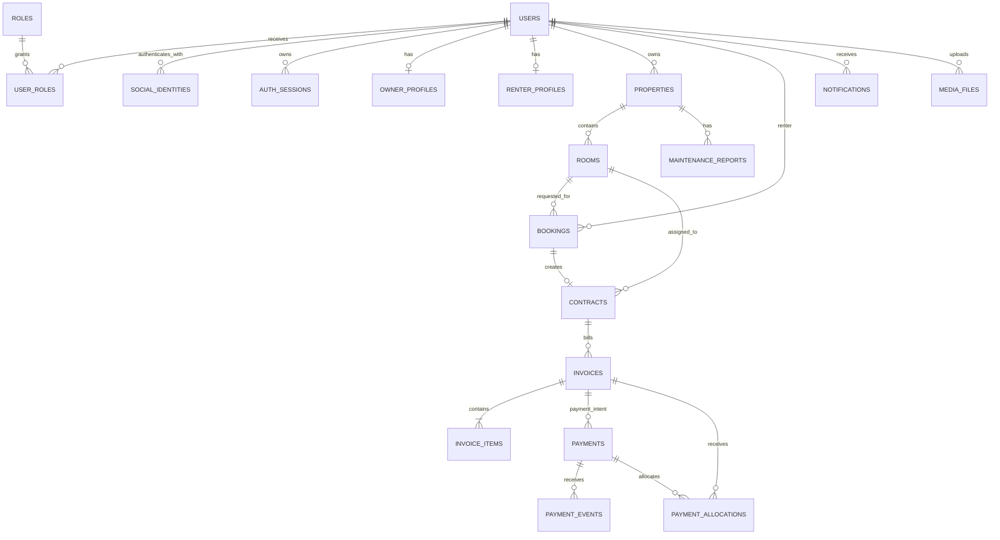
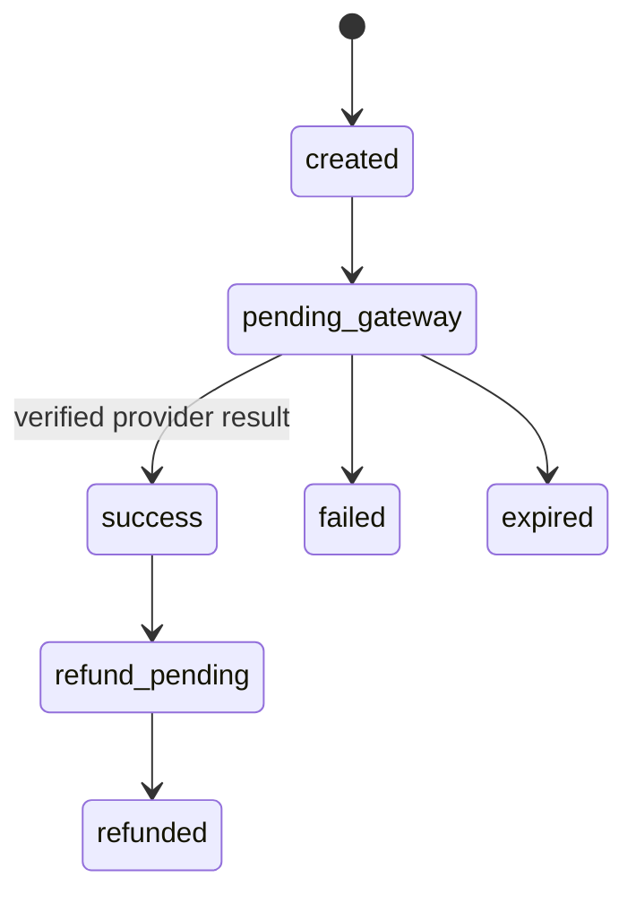

# PostgreSQL baseline

The first migration owns the complete GLI-12 baseline. Application startup never uses
`synchronize`; every schema change must be a reviewed migration.

Registration OTP challenges are keyed by normalized email and purpose without a user foreign key;
legacy phone challenges remain nullable compatibility rows. Verification timestamps are persisted,
while the OTP remains only an HMAC digest and is consumed during account creation. New-user phone values are contact data, while
`phone_login_enabled` limits the legacy unique phone credential index to migrated phone accounts.
forgot-password requests can return an enumeration-safe response. `AUTH_THROTTLE_BUCKETS` stores
keyed HMAC digests of email/IP/device keys and bounded windows; neither table stores an OTP code or raw
throttle key.
`AUTH_SESSIONS` stores only refresh-token hashes and a family identifier used to revoke every
descendant when a rotated token is reused.

## Booking and contract support

Bookings retain renter, owner, room and viewing-window snapshots through foreign keys and indexed
schedule fields. The schema permits the approved flow while leaving conflict-resolution policy to
the booking feature issue. One booking can produce at most one contract, and one room can have at
most one `active` contract. Signed timestamps and immutable `terms_snapshot` support the proposed
contract flow and later PDF generation.

## Billing and payment support

Invoices own debt state and expose a generated outstanding amount. Payments own gateway state,
unique idempotency keys and unique provider references. `payment_events` is the idempotent webhook
inbox; `payment_allocations` is billing-owned evidence that a verified successful payment was
applied to an invoice. An invoice cannot be marked paid merely because a browser redirect succeeds.

## Migration and seed policy

1. Migrations are immutable after merge and execute transactionally.
2. `synchronize` stays disabled in every environment.
3. Deployment runs migration, idempotent seed and schema verification before application rollout.
4. Rollback uses `db:migration:revert`; data migrations require an explicit recovery plan.
5. Reference roles (`renter`, `owner`, `admin`) are seeded separately so migrations remain schema-focused.
