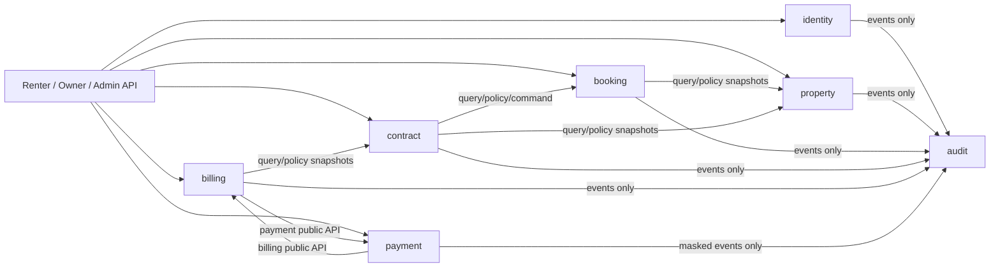

# Module boundaries

This repository implements the boundary decision recorded by PM for GLI-12.

| Module | Owns | Public collaboration surface |
| --- | --- | --- |
| identity | users, roles, profiles and access | `IdentityQueryService`, `IdentityAccessService` |
| property | properties, rooms and inventory status | `PropertyQueryService`, `PropertyPolicyService`, `PropertyCommandService` |
| booking | viewing request lifecycle | `BookingQueryService`, `BookingPolicyService`, `BookingCommandService` |
| contract | rental contract and signed terms | `ContractQueryService`, `ContractPolicyService`, `ContractCommandService` |
| billing | invoices, items, debt and allocations | `BillingQueryService`, `BillingPolicyService`, `BillingCommandService`, `BillingPaymentService` |
| payment | intents, gateway transactions and webhooks | `PaymentQueryService`, `PaymentIntentService`, `PaymentCommandService` |
| audit | append-only security/business/data trail | `AuditLogService` |

Supporting modules own `maintenance_reports`, `notifications` and `media_files`. Their detailed
business interfaces remain intentionally empty until their feature issues define lifecycle rules.

## Enforced dependency direction

`identity` never depends on business modules. `audit` is sink-only. Payment success changes an
invoice only through `BillingPaymentService`; billing creates or reads transactions only through
payment's public interfaces. The transactional outbox allows reliable event publication without
letting consumers write another module's tables.

`test/architecture-boundaries.spec.ts` fails when a domain source file directly imports a different
domain package. API composition roots are intentionally exempt because APIs may call domains.
